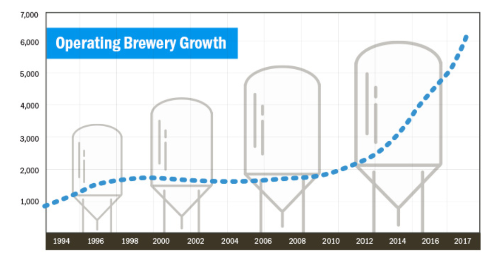

```{r setup, include=FALSE}
knitr::opts_chunk$set(echo = TRUE)
```

# Introduction
Craft beers have grown in popularity since the early 2000's and have skyrocketed in 2010 (Figure 1).  In the US alone there are well over 150 styles of beer with as many breweries in each state.  Knowing the pallet of potential customers can gain a brewery an edge in profit margins by staying close to what the customer wants.  This study will illuminate several of these basic statics.


* Possible audience
    + Investors
    + New brew masters
    + Trip advisor




```{r LoadLibraries}
#Load necessary libraries for the project.
library(ggplot2)
library(DataExplorer)
library(dplyr)
```

# Question 1
## Where and how many breweries are in the US?
The results indicate which states may be over populated with breweries and states that have not seen a wild growth in breweries.

```{r BreweriesByState, echo=TRUE}
##############################################
#####                          ###############
#####         Load Data        ###############
#####        Basic details     ###############
#####                          ###############
##############################################

#Read CSV file into R
Beers <- read.csv("Beers.csv", header=TRUE, sep=",", strip.white = TRUE)
Breweries <- read.csv("Breweries.csv", header=TRUE, sep=",", strip.white = TRUE)

##############################################
#####                          ###############
#####                          ###############
#####    Make State DB         ###############
#####                          ###############
##############################################

#Create State DB data frame
StateDB <- data.frame(state.name, state.abb, state.region)
#Rename columns for readability
colnames(StateDB)[colnames(StateDB)=='state.name'] <- 'StateName'
colnames(StateDB)[colnames(StateDB)=='state.abb'] <- 'State'
colnames(StateDB)[colnames(StateDB)=='state.region'] <- 'StateRegion'

#Add district of Columbia to StateDB Data Frame
DistrictColumbia <- data.frame("District of Columbia","DC", "South")
names(DistrictColumbia) <- c("StateName","State", "StateRegion")
StateDB <- rbind(StateDB, DistrictColumbia)

#head(StateDB,2) #Assuming this was for debugging purposes.

##############################################
#####                          ###############
#####         Question 1       ###############
#####    Breweries per state   ###############
#####                          ###############
##############################################
#count of breweries by state
BreweryCounts <- data.frame(table(Breweries$State))

#rename column names
colnames(BreweryCounts)[colnames(BreweryCounts)=='Var1'] <- 'State'
colnames(BreweryCounts)[colnames(BreweryCounts)=='Freq'] <- 'NumberOfBreweriesByState'

#Merge the StateDB and sort by count of breweries by state
BreweryCounts <- merge(BreweryCounts, StateDB, by.x=("State"), by.y=("State"))
BreweryCounts <- BreweryCounts[order(BreweryCounts$NumberOfBreweriesByState, decreasing=TRUE),c(3,2)]
BreweryCounts
```

# Question 2
## Merging Data
The team merged both the beer and breweries data sets in order to get a better wholelistic view of the data and determine how they relate to each other.  Below will show the first and last six rows of the data sets.

```{r MergeData, echo=TRUE}
##############################################
#####                          ###############
#####         Question 2       ###############
#####       Merge Data Sets    ###############
#####                          ###############
##############################################

#join data on Brewery_id and Brew_ID 
BeersAndBreweries <- merge(Beers, Breweries, by.x=("Brewery_id"), by.y=("Brew_ID"))

#list column names on the joined data frame
#colnames(BeersAndBreweries) #assuming this was for debugging purposes

#rename the name.x(Beer) and name.y(Brewery) after the merger
colnames(BeersAndBreweries)[colnames(BeersAndBreweries)=='Name.x'] <- 'BeerName'
colnames(BeersAndBreweries)[colnames(BeersAndBreweries)=='Name.y'] <- 'BreweryName'

# I don't think we don't need to create this again.
# #Create State DB data frame
# StateDB <- data.frame(state.name, state.abb, state.region)
# colnames(StateDB)[colnames(StateDB)=='state.name'] <- 'StateName'
# colnames(StateDB)[colnames(StateDB)=='state.abb'] <- 'State'
# colnames(StateDB)[colnames(StateDB)=='state.region'] <- 'StateRegion'
# 
# #Add district of Columbia to StateDB Data Frame
# DistrictColumbia <- data.frame("District of Columbia","DC", "South")
# names(DistrictColumbia) <- c("StateName","State", "StateRegion")
# StateDB <- rbind(StateDB, DistrictColumbia)


#Merge data with State DB
BeersAndBreweries <- merge(BeersAndBreweries, StateDB, by="State", all = TRUE)

# dont think we need to show this.
# #find dimensions of data frames
# dim(BeersAndBreweries)
# dim(BeersAndBreweries)

#Show first and last 6 entries of merged files
head(BeersAndBreweries)
tail(BeersAndBreweries)
```

# Question 3
## Report Missing Values
To do a complete analysis the team needed to asses if the merged data set has any missing values.  The team created a report for both a graphical and tabular representation of the results. The team utilized code from http://www.gettinggeneticsdone.com/2011/02/summarize-missing-data-for-all.html to count NA's in columns.

The data shows the variables with missing data are the IBU and ABV values.
```{r MissingValues, echo=TRUE}
#Graphical representation of missing vaules using 'DataExporer' library
plot_missing(BeersAndBreweries, title = "Percent of Missing Values")

#Function to count all NA's in columns (sourced from the internet)
#http://www.gettinggeneticsdone.com/2011/02/summarize-missing-data-for-all.html
propmiss <- function(dataframe) {
  m <- sapply(dataframe, function(x) {
    data.frame(
      na_count=sum(is.na(x)),
      Obs=length(x), 
      perc_missing=sum(is.na(x))/length(x)*100
    )
  })
  d <- data.frame(t(m))
  d <- sapply(d, unlist)
  d <- as.data.frame(d)
  d$variable <- row.names(d)
  row.names(d) <- NULL
  d <- cbind(d[ncol(d)],d[-ncol(d)])
  return(d[order(d$na_count, decreasing=TRUE), ])
}

#show results of NA's counted
BeerColumnInventory_nacount <- propmiss(BeersAndBreweries)
BeerColumnInventory_nacount
```

# Question 4
## Plotting Data
The team in order to look for trends plotted the ABV and IBU against the states to determine which states had the highest median value of each of tthe states by value.

* Process to analyze
    + Calculate the median values of ABV & IBU by state
    + Plot the data against states and sort by highest value

*As requested by the client all NA's have been removed*
```{r Plotting, echo=TRUE}
#Make data frame with only State, ABV, IBU
DF_ABV_IBU <- BeersAndBreweries[,c("StateName","ABV","IBU")]
#head(DF_ABV_IBU)  #I don't think we don't need to show this.

#remove any rows with a NA value using 'complete.cases'
DF_ABV_IBU_noNA <- DF_ABV_IBU[complete.cases(DF_ABV_IBU),]
#head(DF_ABV_IBU_noNA) #I don't think we don't need to show this.

#Calculate MEDIAN values for ABV&IBU by State
MEDIAN_ABV_IBU_by_State <- aggregate(DF_ABV_IBU_noNA[, 2:3],list(DF_ABV_IBU_noNA$StateName), median)
#head(MEDIAN_ABV_IBU_by_State) #I don't think we don't need to show this.

#Rename column names
colnames(MEDIAN_ABV_IBU_by_State)[colnames(MEDIAN_ABV_IBU_by_State)=='Group.1'] <- 'State'
colnames(MEDIAN_ABV_IBU_by_State)[colnames(MEDIAN_ABV_IBU_by_State)=='ABV'] <- 'Median_ABV'
colnames(MEDIAN_ABV_IBU_by_State)[colnames(MEDIAN_ABV_IBU_by_State)=='IBU'] <- 'Median_IBU'

#Check data
#head(MEDIAN_ABV_IBU_by_State,10) #I don't think we don't need to show this.

#######  Plot MEDIAN ABV By State   #########
BarPlot_ABV_byState <- ggplot(data=MEDIAN_ABV_IBU_by_State, 
                              aes(x=reorder(State, Median_ABV), 
                                  y=Median_ABV)) +
                                  geom_bar(stat="identity")+
                                  coord_flip() +
                                  labs(x="State",
                                       y="Median ABV",
                                       title = "Median Alchol Content by State")
BarPlot_ABV_byState

#######  Plot MEDIAN IBU By STate   #########
BarPlot_IBU_byState <- ggplot(data=MEDIAN_ABV_IBU_by_State, 
                              aes(x=reorder(State, Median_IBU), 
                                  y=Median_IBU)) +
                              geom_bar(stat="identity")+
                              coord_flip()+
                              labs(x="State",
                                   y="Median_IBU",
                                   title = "Median Bitterness Content by State")
BarPlot_IBU_byState

```

# Question 5
## States with highest ABV and IBU
For a quick reference the team identified the states with the highest ABY and IBU recorded within the data set.

```{r MaxValues, echo=TRUE}
#Find MAX ABV with State
MAX_ABV_byState <- head(BeersAndBreweries[order(BeersAndBreweries$ABV, na.last = TRUE, decreasing=TRUE),c(11,5)],1)
MAX_ABV_byState

#Find MAX IBU with State, column has missing values
MAX_IBU_byState <- head(BeersAndBreweries[order(BeersAndBreweries$IBU, na.last = TRUE, decreasing=TRUE),c(11,6)],1)
MAX_IBU_byState
```

# Question 6
## Summary of ABV
As part of the analysis the team has provided the summary results for the ABV variable.

```{r SummaryABV, echo=TRUE}
##############################################
#####                          ###############
#####     Question 6           ###############
##### Summary of ABV Variable  ###############
#####                          ###############
##############################################

#Summary Stats of the ABV variable
SUMMARY_ABV <- summary(BeersAndBreweries$ABV)

#Show ABV SUmmary
SUMMARY_ABV
```

# Question 7
## Relationship between ABV & IBU
To determine any realtionships between ABV and IBU a scatterplot was created.  In addition the data was color coded by the region of the brewery.

```{r Relationships, echo=TRUE}
#Merge data with State DB
DF_ABV_IBU_noNA <- merge(DF_ABV_IBU_noNA, StateDB, by="StateName", all = TRUE)

#Remove rows with NA's
DF_ABV_IBU_noNA <- DF_ABV_IBU_noNA[complete.cases(DF_ABV_IBU_noNA),]

#Check merge and top of the file
propmiss(DF_ABV_IBU_noNA)
head(DF_ABV_IBU_noNA)

#Scatter plot ABV vs IBU and color by StateRegion
ABUvsIBU <- qplot(ABV, IBU, 
                  xlab = "ABV (Alcholo Content)",
                  ylab = "IBU (Bitterness)",
                  main= "ABV vs IBU", 
                  colour=StateRegion,
                  data=DF_ABV_IBU_noNA)

#Show Scatter Plot
ABUvsIBU
```